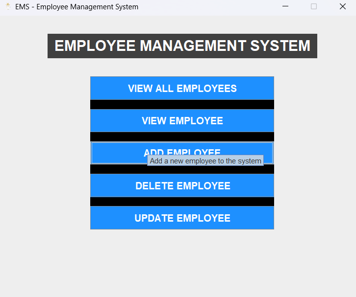
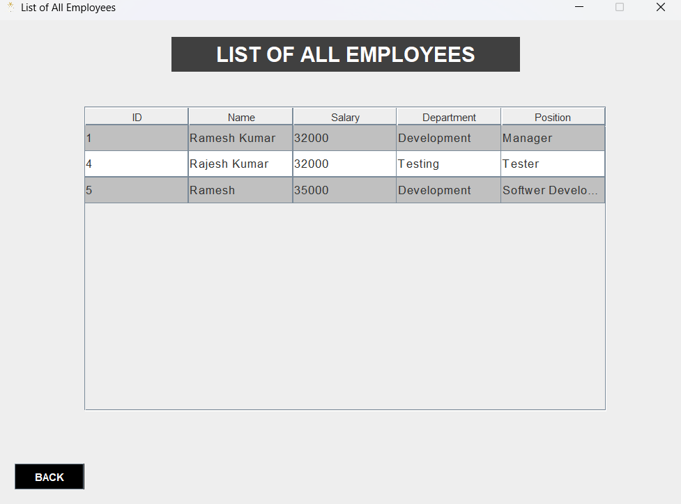
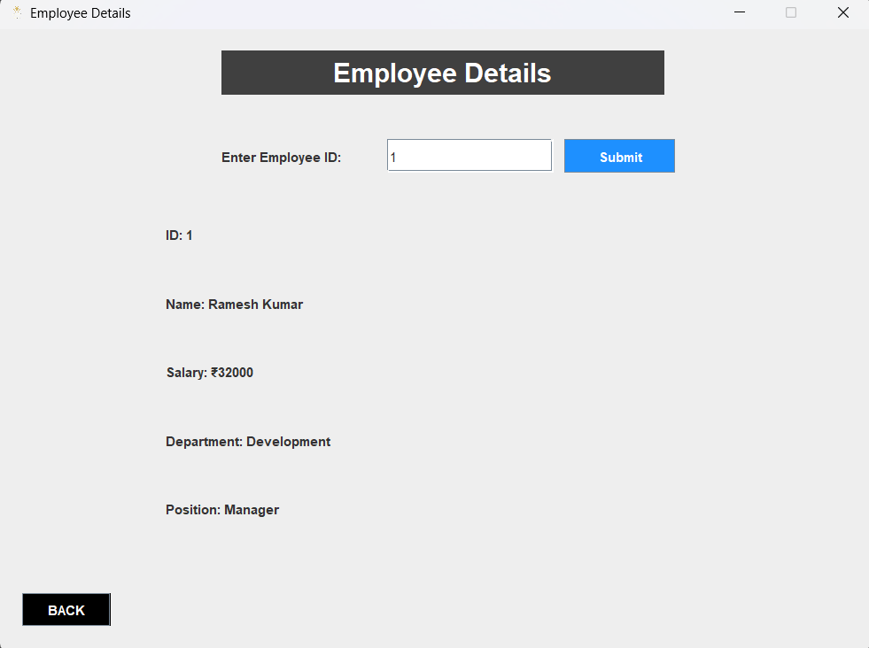
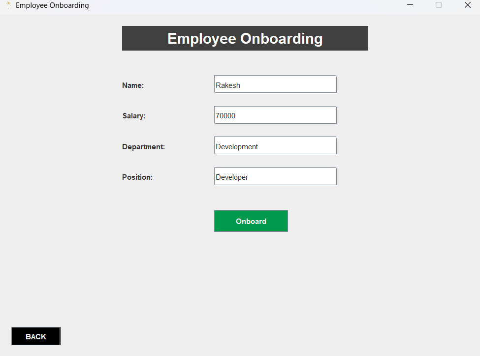
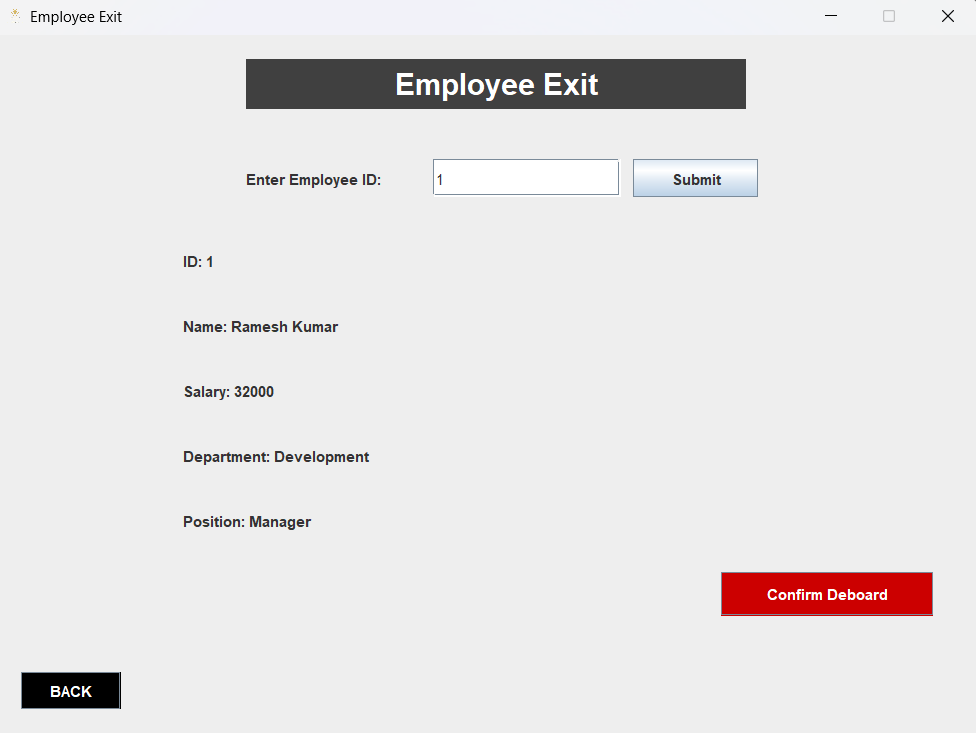
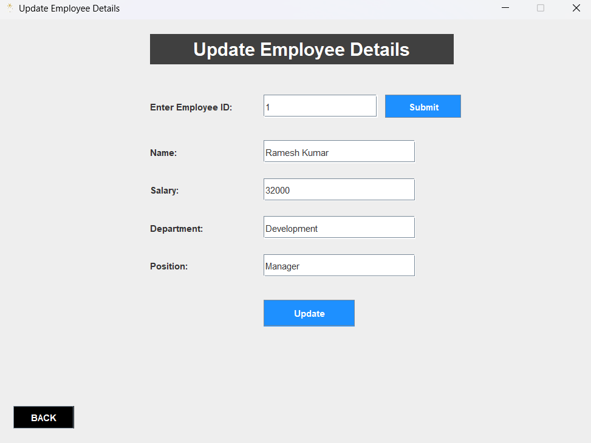

# 🧑‍💼 Employee Management System (EMS)

A desktop-based Java Swing application to manage employee records — including onboarding, viewing, updating, and deleting employee details via JDBC.

---

## ✨ Features

- 👤 Add new employees  
- 📋 View all employee records  
- 🔍 View individual employee details  
- 📝 Update existing employee information  
- ❌ Delete employee records  
- 🎨 Simple and responsive UI using Java Swing  

---

## 📸 Screenshots

### 🏠 Home Screen  

### 📋 View All Employees  

### 🔍 View Single Employee  

### ➕ Add Employee  

### ❌ Delete Employee  

### 🔄 Update Employee  

---

## 🛠 Technologies Used

- **Java** (JDK 8 or higher)  
- **Java Swing** for GUI  
- **JDBC** for database interaction  
- **MySQL** for backend database  
- **Eclipse IDE** for development  

---

## 🚀 How to Run

1. ✅ Make sure Java and MySQL are installed.
2. 🔃 Clone this repository:
git clone https://github.com/your-username/EMS_Project.git

3. 🛠 Set up the MySQL database (import or create the `employees` table).
4. 🔧 Update DB credentials in `DBConnection.java`.
5. ▶️ Run from Eclipse **OR** double-click `EMS_Launcher.bat` to launch.

---

## 📁 Project Structure

EMS_Project/
│
├── screenshots/
│ ├── home.png
│ ├── view_all.png
│ ├── view_single.png
│ ├── add_employee.png
│ ├── delete_employee.png
│ └── update_employee.png
│
├── src/
│ ├── com/ems/ui/
│ └── com/ems/db/
│
├── EMS_Project.jar
├── EMS_Launcher.bat
├── README.md
└── .gitignore

---

## 🙋 Author

**Darshan Kumar GP**

---

## 📄 License

This project is licensed under the [MIT License](LICENSE).

